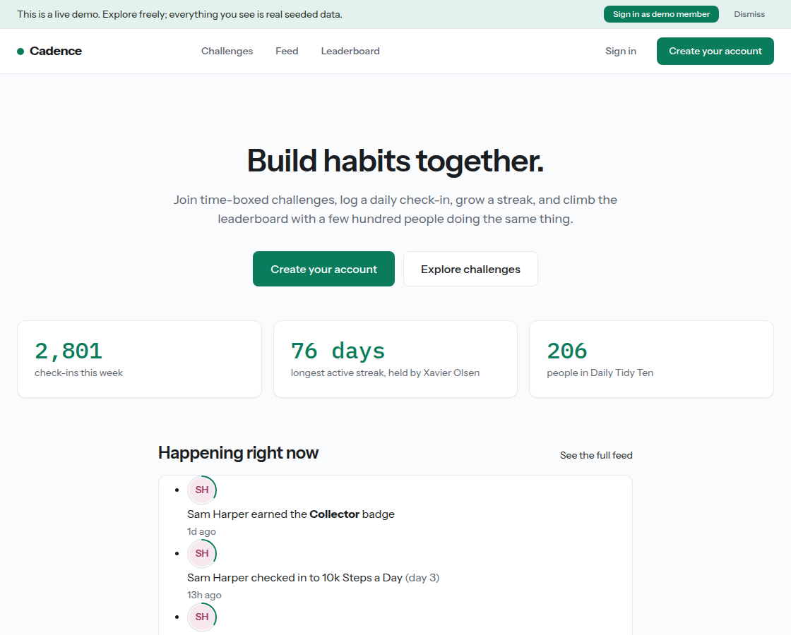
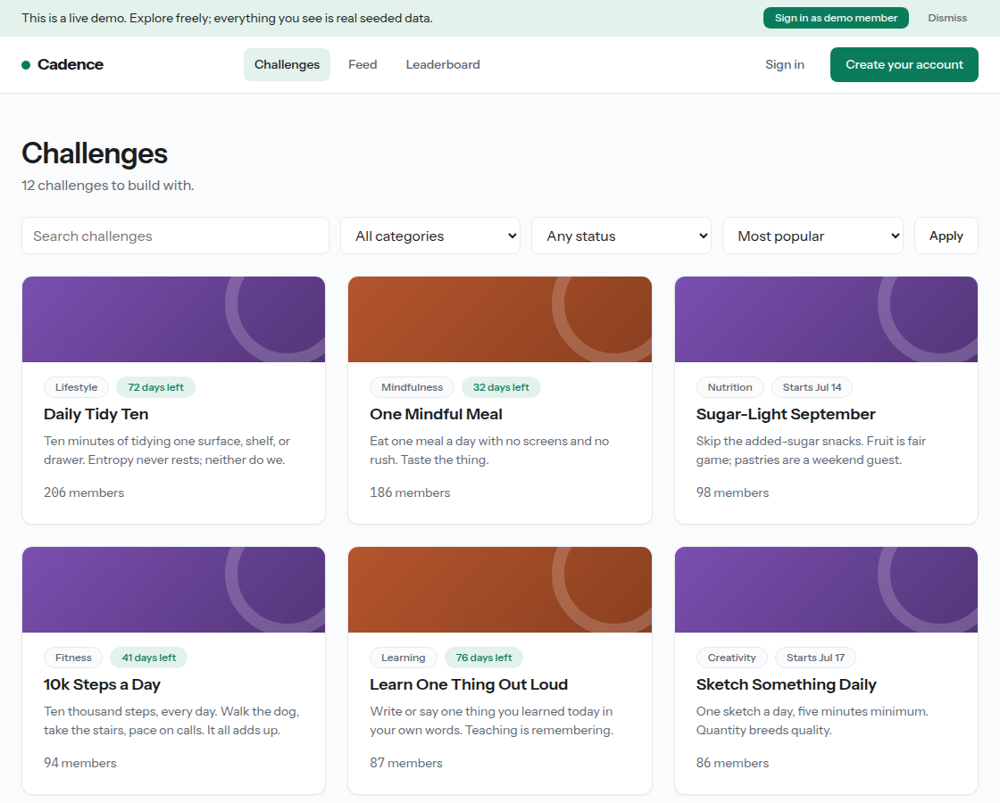
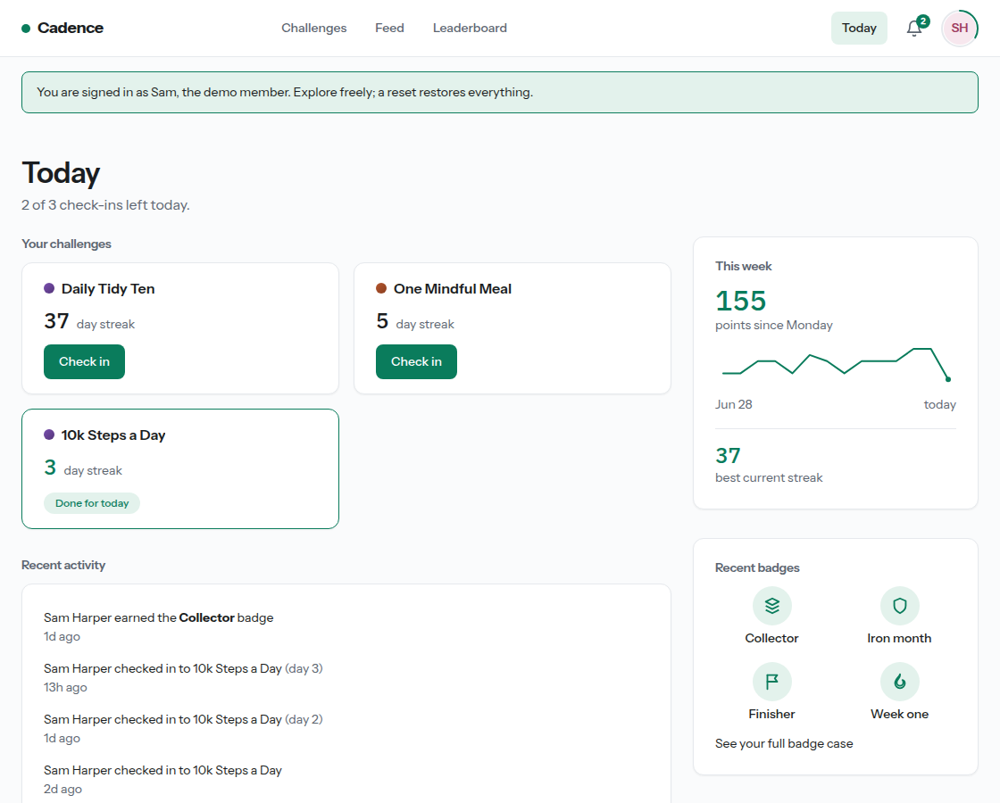
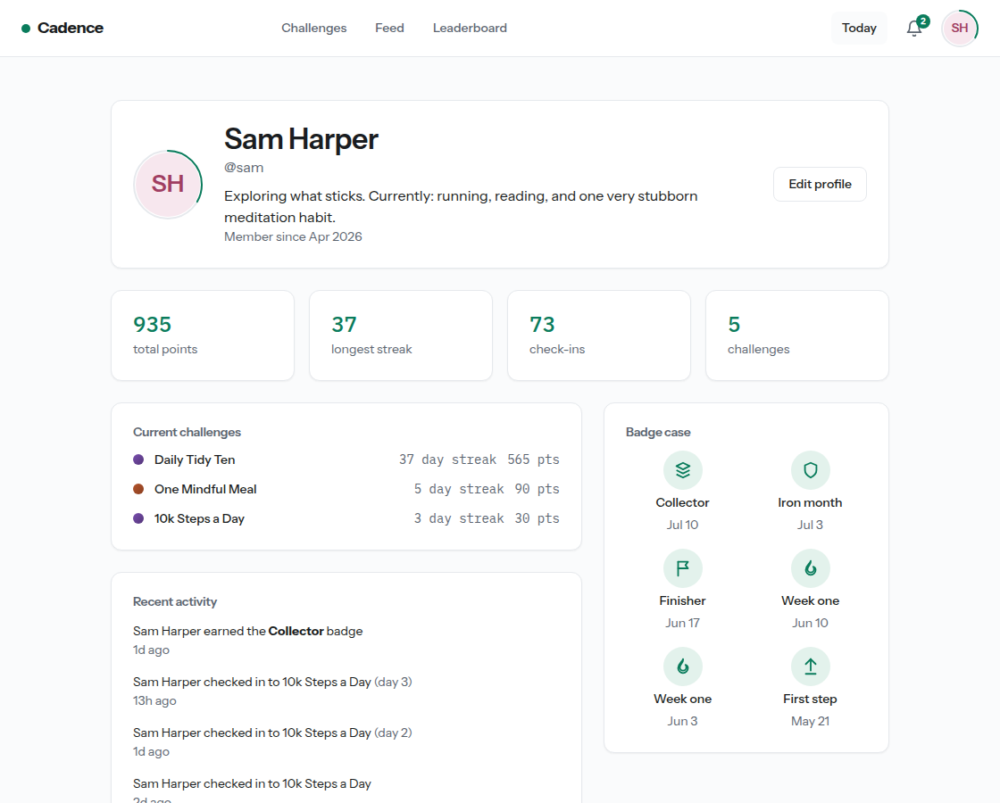
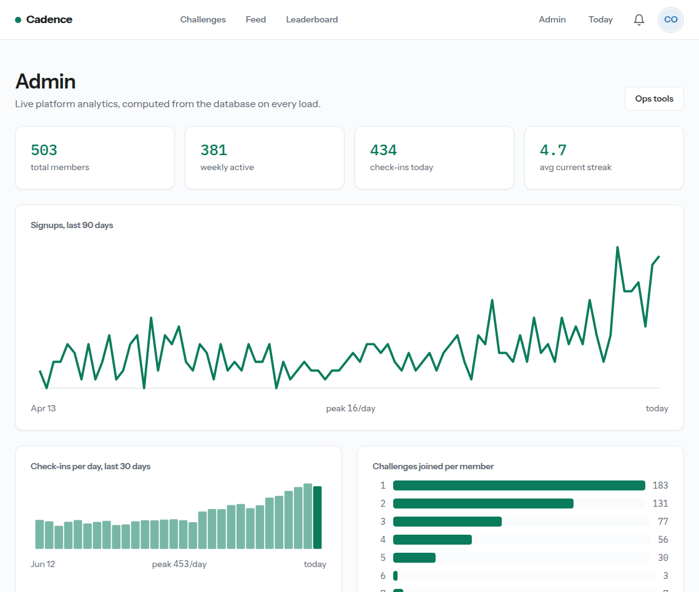
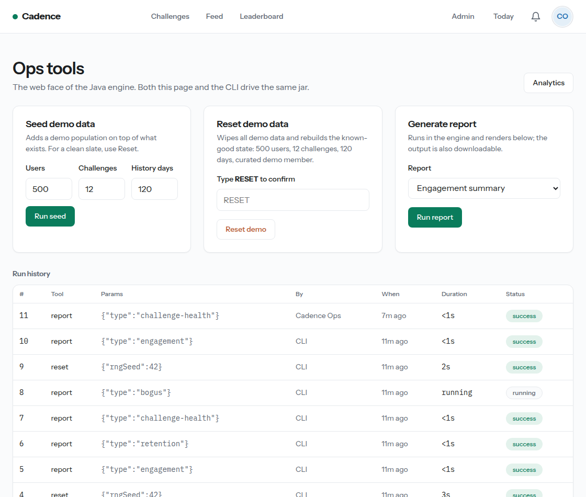

# Cadence

**Build habits together.** Users join time-boxed challenges, log daily check-ins, build streaks, earn badges, and compete on leaderboards.

Cadence is a complete, production-grade SaaS built as a portfolio piece: PHP 8 with no framework, MySQL behind PDO prepared statements, and a Java ops engine that seeds, resets, and reports on the whole platform from one runnable jar. It ships pre-populated with 500 realistic demo users and 120 days of history so it opens looking alive, tested, and operated.



## What a reviewer should look at

| If you care about | Look at |
|---|---|
| Product feel | The homepage, then one click on "Sign in as demo member" |
| PHP fundamentals | `public/index.php` front controller, `app/Core/`, `app/Models/CheckIn.php` |
| Schema design | `database/schema.sql` (constraints do the enforcement, not app code) |
| Security posture | `docs/SECURITY.md`, the single CSRF gate, the rate limiter |
| Ops tooling | `engine/` (Java), `/admin/tools` in the app, `docs/RUNBOOK.md` |
| Decisions and tradeoffs | `docs/ARCHITECTURE.md`, including alternatives considered |

## The five-minute quickstart

Requirements: PHP 8.1+, MySQL 8 or MariaDB 10.6+, a JDK 17+ (only to build the jar once).

```sh
# 1. Database
mysql -u root -e "CREATE DATABASE cadence CHARACTER SET utf8mb4 COLLATE utf8mb4_unicode_ci;
                  CREATE USER 'cadence'@'localhost' IDENTIFIED BY 'pick-a-password';
                  GRANT ALL ON cadence.* TO 'cadence'@'localhost';"
mysql -u cadence -p cadence < database/schema.sql

# 2. Config (both files are gitignored)
cp config/config.example.php config/config.php
cp config/engine.example.properties config/engine.properties
# edit both: DB credentials, base_url

# 3. Build the ops engine and load the demo world
engine/build.sh
java -jar engine/build/cadence-engine.jar reset --confirm

# 4. Serve
php -S 127.0.0.1:8080 -t public public/index.php
```

Open http://127.0.0.1:8080. The demo ribbon signs you in as Sam Harper, the curated demo member. The admin account is `admin@cadence.demo` / `cadence-admin` (change it in Settings after first login).

## The core loop

Browse challenges, join, check in once a day, watch the streak ring fill.



Check-ins are enforced one-per-day by a database unique key, streaks roll over at midnight in each user's own timezone, and milestones at 7, 30, and 100 days pay a bonus, write a feed event, and award badges, all in one transaction.



Every avatar carries the streak ring: full means every active challenge is checked in today. It appears in the feed, on leaderboards, and on profiles, so the seeded community reads as alive at a glance.



## The ops story

One Java engine, two thin faces. The CLI:

```sh
java -jar cadence-engine.jar seed --users=500 --challenges=12 --history-days=120
java -jar cadence-engine.jar reset --confirm
java -jar cadence-engine.jar report --type=engagement
```

And the web admin, which invokes the same jar, streams its stdout into a live panel, and records every run in `ops_runs`:





`reset --confirm` is the interview feature: it wipes all demo data (and only demo data), reseeds 500 users with archetype-driven histories (committed, consistent, struggling, lapsed, fresh), rebuilds the curated demo member, and finishes in seconds. The RNG is seeded, so the same command produces the same world every time.

## Repository map

```
public/        web root: front controller, assets (self-hosted fonts, no CDNs)
app/Core/      router, PDO wrapper, DB sessions, CSRF, rate limiter, mail spool
app/Models/    all SQL lives here, behind prepared statements
app/Views/     PHP templates, escaped output only
engine/        Java 17 ops engine, built with javac + jar, no Maven
database/      schema.sql (idempotent) and migrations/
config/        .example templates; real credentials never committed
docs/          this file, RUNBOOK, ARCHITECTURE, SECURITY
scripts/       streak-tests.php (executable spec), deploy checklist
```

## Documentation

- [RUNBOOK.md](RUNBOOK.md): deploy to shared hosting, seed, reset, mail spool, troubleshooting
- [ARCHITECTURE.md](ARCHITECTURE.md): how it works and the alternatives considered
- [SECURITY.md](SECURITY.md): threat model and the mitigations implemented
